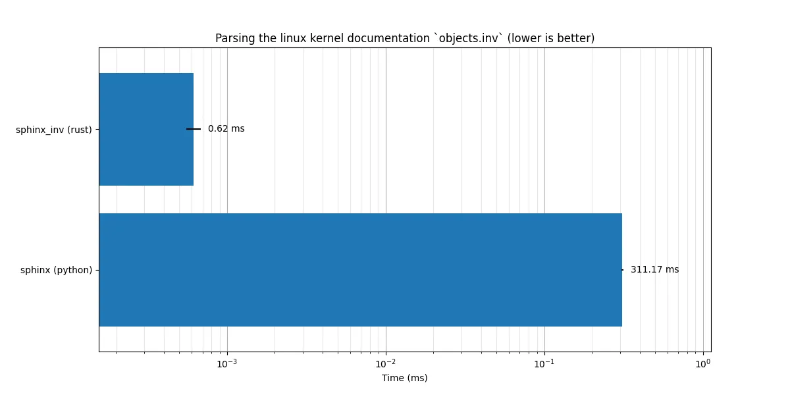

# sphinx_inv

[](https://opensource.org/licenses/MIT)
[](https://codecov.io/gh/savente93/sphinx_inv)
[](https://crates.io/crates/sphinx_inv)
[](https://docs.rs/sphinx_inv)


A rust library to parse Sphinx `objects.inv` files.

Sphinx the documentation generator will output a file called `objects.inv` containing data so that other websites can link to it easily. This library is made to read, parse, and write files like that. It was initially developed for use in [snakedown](https://github.com/aslowwriter/snakedown) but should be useful for anyone wanting to interact with these files.

While developing snakedown it turned out that parsing these inventory files was a much more significant bottleneck than expected, which is why we developed a parser for it instead of relying on regex like the sphinx implementation does. A performance comparison based on parsing the linux kernel documentation `objects.inv` file shows the differences in implementation (note the log scale):



## Usage

To use the library simply add it to your project:

```
cargo add sphinx_inv
```

The main entry points of this create are the the [`InventoryHeader`](https://docs.rs/sphinx_inv/latest/sphinx_inv/struct.InventoryHeader.html) and [`SphinxReference`](https://docs.rs/sphinx_inv/latest/sphinx_inv/struct.SphinxReference.html) data
structs and the [`SphinxInventoryReader`](https://docs.rs/sphinx_inv/latest/sphinx_inv/struct.SphinxInventoryReader.html) and [`SphinxInventoryWriter`](https://docs.rs/sphinx_inv/latest/sphinx_inv/struct.SphinxInventoryWriter.html)
structs to handle with them.

The [`SphinxInventoryReader`](https://docs.rs/sphinx_inv/latest/sphinx_inv/struct.SphinxInventoryReader.html) and [`SphinxInventoryWriter`](https://docs.rs/sphinx_inv/latest/sphinx_inv/struct.SphinxInventoryWriter.html) can work with any struct that
immplements [`std::io::Read`](https://doc.rust-lang.org/stable/std/io/trait.Read.html) and [`std::io::Write`](https://doc.rust-lang.org/stable/std/io/trait.Write.html) respectively. These are internally buffered
so you do not have to wrap them yourself.

When interacting with real `objects.inv` files in the wild you will most likely use the base
reader and writer struct, but both also have a `PlainText` variant. The only difference is that
the plain text versions don't encode/decode the data in zlib like the files do. This is mostly
useful for debugging/testing/demoing. In the following examples we will use the plain text versions and
the [`std::io::Cursor`](https://doc.rust-lang.org/nightly/std/io/struct.Cursor.html) to make it easier to display the results, but the code should work
basically unchanged by switching to a [`std::fs::File`](https://doc.rust-lang.org/nightly/std/fs/struct.File.html) and the base readers and writers.

## Example

```rust
use sphinx_inv::*;
use std::fs::File;
use std::io::{Read, Write, Cursor};
use pretty_assertions::assert_eq;

let header = InventoryHeader::new("Sphinx Inv", "0.2.0");

let join_reference = SphinxReference::new(
    "str.join".to_string(),
    SphinxType::Python(PyRole::Method),
    None,
    "library/stdtypes.html#$".to_string(),
    None);

let lower_reference = SphinxReference::new(
    "str.lower".to_string(),
    SphinxType::Python(PyRole::Method),
    None,
    "library/stdtypes.html#$".to_string(),
    None);

let mut buffer = Vec::new();

let mut cursor = Cursor::new(buffer);

// the capacity is just to preallocate the internal buffer, it can be anything
let mut writer = PlainTextSphinxInventoryWriter::from_header(&header, 2);


// add the references to the writer
writer.add_reference(&join_reference);
writer.add_reference(&lower_reference);

// add_reference on it's own only adds it to the internal buffer
// nothing actually happens until you call [`SphinxInventoryWriter::finalize`]
writer.finalize(&mut cursor).unwrap();

let written = String::from_utf8(cursor.into_inner()).unwrap();

assert_eq!(&written, "# Sphinx inventory version 2
# Project: Sphinx Inv
# Version: 0.2.0
# The remainder of this file is compressed using zlib.
str.join py:method 1 library/stdtypes.html#$ -
str.lower py:method 1 library/stdtypes.html#$ -
");

let mut cursor = Cursor::new( written);

let mut reader = PlainTextSphinxInventoryReader::from_reader(cursor).unwrap();

assert_eq!(&header, reader.header());

assert_eq!(reader.next().unwrap().unwrap(), join_reference);
assert_eq!(reader.next().unwrap().unwrap(), lower_reference);
```

## Benchmarks

To run the benchmarks we recommend you have the following tools installed (though only hyperfine and cargo are required):

- [cargo](https://rust-lang.org) to compile the project
- [hyperfine](https://github.com/sharkdp/hyperfine) for running the benchmarks and generating the timing data
- [uv](https://github.com/astral-sh/uv) to manage the dependencies of and run the python script for generating the plot
- [just](https://github.com/casey/just) to run the commands
- [curl](https://github.com/curl/curl) for downloading the objects.inv file

if you have all these, running the benchmarks should be as easy as

```
just benchmark
```

this will:
1. download the linux kernel docs object file
2. compile the wrapper binaries
3. use hyperfine to run the benchmarks
4. run the plotting script through uv

if you want to benchmark a different `objects.inv` file all you have to do is replace the url in this line of the `justfile` :

```
curl -Lo objects.inv https://docs.kernel.org/objects.inv
```

Note: due to differences in hardware or parsing files, the actual value of the timings may be quite different than the ones in the plot, but the relative ordering of the implementations should remain the same.

The benchmark is setup as follows:

1. the rust implementations have a binary that simply parses the file `objects.inv` from the current working directory and discards the output with the respective implementation
2. for python, rather than simply using sphinx as a directory, to ensure on the work relating to parsing the file is included in the comparison, we copied the relevant code into it's own python script, the file to the commit that was copied from can be found at the top of the `sphinx.py` script. Other than comminging out some unnecessary imports and adding a `if __name__ == '__main__':` at the bottom which also simply parses the `objects.inv` file and discards the output, the code has been left unchanged.
3. the rust binaries are compiled (in release mode)  and hyperfine is used to run both the binaries and the python script and do the comparison.

I've done my best to make the comparison as fair as possible, but if you know of ways we can be more accurate in our comparison please open an issue!


## FAQ

### Q: I have a file that isn't parsing!

A: Since this is written in a compiled language we can't easily install extensions like python can, therefore it is very possible that you have a valid file that isn't parsing correctly. Because there is a lot of extensions out there and it is unclear how many of them are still actively used we limited ourselves to a few of the bigger projects (like `http`, `sip` provided by PyQt, and `cmake`). If you have one that we don't support yet, please [open an issue](https://github.com/aslowwriter/sphinx_inv/issues/new), we'd love to fix it!

Regardless of whether you found a bug, or a domain/role you'd like us to support, if possible please include the file that has the failing lines (if it is publicly available a link to the file we can download is sufficient), if not provide at least an example line. If there are any links to documentation of the domain and roles available we'd love those as well!

### Q: What's the status of the project?

A: Currently the project is mostly "done." That means that it does what I need it to do for now, so it may not see regular updates. However, I'm happy to take bug reports and feature requests, and may implement functionalities as needed. The project is still maintained, but I'd rather wait to have actual usecases we can address properly rather than implement a bunch of features nobody is interested in.

### Q: Can I use this in my python code?

A: Not currently because I haven't had a need for that. However, I see no reason it couldn't be made available if anyone would like it. So if you want to use it from python, please open a feature request.

## Acknowledgements

- Thank you to Brian Skinn et al. for all the research they did into the format
  which they documented in the [sphobjinv package](https://sphobjinv.readthedocs.io/en/stable/syntax.html)
  They have been invaluable in writing this library.
- Thank you to `@BurntSushi` for writing the `csv` crate which has been a great example
  to follow when designing the API

## Template

This repo was initially setup using [`cargo-generate`](https://github.com/cargo-generate/cargo-generate) and [this template](https://github.com/aslowwriter/rust-template)
